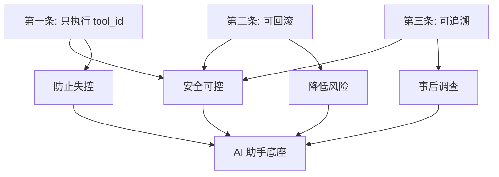

# ⚖️ Automation Hub 三条铁律

## 为什么需要这三条铁律？

个人自动化平台的核心挑战是**在保持灵活性的同时防止失控**。AI 可以极大提高效率，但如果允许它执行任意命令，风险不可控。

这三条铁律是 Automation Hub 从"脚本执行器"升级为"AI 工具助手底座"的核心原则。

---

## 第一条：只能执行 tool_id（白名单工具），不接受任意字符串命令

### ❌ 错误做法

```python
# 危险：直接执行用户/AI 提供的命令
user_command = "rm -rf /important/data"
subprocess.run(user_command, shell=True)
```

### ✅ 正确做法

```python
# 安全：只能执行预注册的工具
tool = get_tool("backup_notes")  # 从注册表获取
if tool.is_enabled:
    execute_tool(tool)
```

### 为什么？

- **防止任意代码执行**：攻击者/有bug的AI无法执行未授权的命令
- **强制参数验证**：所有工具都有 JSON Schema，参数必须合法
- **审计可追溯**：tool_id 明确，知道执行了什么
- **可控的攻击面**：只有注册的工具可执行，新工具需要人工审查

### 实施方式

1. **工具注册制**：所有可执行操作必须先注册到 Tools Registry
2. **参数化命令**：工具定义中的 command 不包含用户输入
3. **Schema 验证**：执行前验证 args 符合 args_schema
4. **禁止 shell=True**：避免命令注入

### 示例

```json
{
  "id": "backup_notes",
  "command": ["python", "/app/scripts/backup_notes.py"],
  "args_schema": {
    "type": "object",
    "properties": {
      "destination": {"type": "string", "pattern": "^/backups/"}
    },
    "required": ["destination"]
  }
}
```

AI 只能调用：
```
POST /runs {"tool_id": "backup_notes", "args": {"destination": "/backups/2026-01"}}
```

不能执行：
```
❌ subprocess.run("rm -rf /")
❌ eval(user_input)
❌ exec(ai_generated_code)
```

---

## 第二条：所有写操作必须可回滚（patch/版本化/备份）

### ❌ 错误做法

```python
# 危险：直接覆盖，无法恢复
with open("config.yaml", "w") as f:
    f.write(new_config)
```

### ✅ 正确做法

```python
# 安全：先备份，再修改
backup_path = create_backup("config.yaml")
try:
    with open("config.yaml", "w") as f:
        f.write(new_config)
    validate_config("config.yaml")
except Exception:
    restore_from_backup(backup_path)
    raise
```

### 为什么？

- **故障恢复**：错误的修改可以撤销
- **安全网**：降低高风险操作的心理负担
- **审计历史**：保留所有变更记录
- **AB 测试**：可以对比修改前后的差异

### 实施方式

#### 方式 1：自动备份

```python
@requires_backup
def modify_file(path: str, content: str):
    with open(path, "w") as f:
        f.write(content)
```

#### 方式 2：版本化存储

```python
# Git 管理的配置文件
git.commit(files=["config.yaml"], message="Update config")
# 回滚
git.checkout(commit="HEAD~1", files=["config.yaml"])
```

#### 方式 3：Patch 模式

```python
# 提案系统：先生成 diff，审批后应用
proposal = create_proposal(
    patch=generate_diff(old_content, new_content),
    rollback_command=["git", "checkout", "HEAD~1"]
)
```

### 工具设计建议

```json
{
  "id": "update_config",
  "risk_level": "write",
  "pre_hooks": ["backup_file"],
  "verify_commands": [
    ["validate_config", "{file_path}"]
  ],
  "rollback_commands": [
    ["restore_backup", "{backup_id}"]
  ]
}
```

---

## 第三条：所有动作必须可追溯（audit log）

### ❌ 错误做法

```python
# 危险：静默执行，无记录
run_command(cmd)
```

### ✅ 正确做法

```python
# 安全：完整记录
audit.log(
    event_type="tool.executed",
    actor=user_id,
    tool=tool_id,
    args=args,
    result=exit_code,
    timestamp=now()
)
run_command(cmd)
```

### 为什么？

- **事后调查**：出问题时知道谁做了什么
- **安全审计**：检测异常行为
- **合规要求**：某些行业必须记录所有操作
- **调试帮助**：追踪问题根源

### 记录内容

#### 最小必需

- **who**：actor_user_id, actor_device_id
- **what**：event_type, action, resource_type, resource_id
- **when**：created_at
- **result**：status (success/fail), message

#### 扩展信息

- **meta**：参数、环境、上下文
- **before/after**：变更前后的状态
- **duration**：执行耗时
- **impact**：影响范围

### 审计事件分类

```
auth.*          认证相关
  auth.login
  auth.token_created
  auth.token_revoked

tool.*          工具相关
  tool.registered
  tool.updated
  tool.disabled

run.*           执行相关
  run.requested
  run.queued
  run.blocked
  run.executed
  run.failed

approval.*      审批相关
  approval.created
  approval.approved
  approval.denied

proposal.*      提案相关
  proposal.created
  proposal.applied
  proposal.rolled_back
```

### 查询示例

```bash
# 查询某用户的所有操作
GET /audit?actor_user_id=user-123

# 查询所有失败的执行
GET /audit?event_type=run.failed&since=2026-01-01

# 查询某资源的变更历史
GET /audit?resource_type=tool&resource_id=backup_notes
```

### 保留策略

- **热数据**：最近 30 天，保存在 SQLite
- **温数据**：30-365 天，导出到文件
- **冷数据**：365 天以上，归档到对象存储

---

## 三条铁律的相互关系



### 场景示例：AI 修改代码

**没有三条铁律：**
```python
# AI: 我来帮你优化这个函数
exec(ai_generated_code)  # 💥 可能删除重要代码
```

**有三条铁律：**

1. **工具白名单**：AI 只能调用 `propose_code_change` 工具
2. **Patch 模式**：生成 diff，不直接修改
3. **审计记录**：记录 AI 提出的修改

```python
# AI 调用
POST /proposals
{
  "title": "优化 process_data 函数",
  "patch": "--- a/utils.py\n+++ b/utils.py\n...",
  "verify_commands": [["pytest", "tests/test_utils.py"]]
}

# 你审查 diff
GET /proposals/{id}

# 你决定
POST /proposals/{id}/apply  # 或 deny

# 失败自动回滚
# 审计完整记录
```

---

## 检查清单

在实现任何新功能时，问自己：

### ✅ 第一条：是否强制 tool_id？

- [ ] 是否可以绕过工具注册直接执行命令？
- [ ] 参数是否有 Schema 验证？
- [ ] 是否有路径遍历等注入风险？

### ✅ 第二条：是否可回滚？

- [ ] 修改前是否有备份？
- [ ] 失败时是否自动回滚？
- [ ] 是否有手动回滚的机制？

### ✅ 第三条：是否有审计？

- [ ] 是否记录了 who/what/when/result？
- [ ] 是否包含足够的上下文信息？
- [ ] 是否可以追溯完整链路？

---

## 常见问题

### Q: 这样不会太慢/太麻烦？

A: 初期会有些额外工作（注册工具、写 Schema），但长期收益巨大：
- 更安全
- 更可维护
- AI 接入更容易
- 出问题时更好调试

### Q: 紧急情况需要绕过怎么办？

A: 提供"紧急通道"工具，但：
- 必须是 `risk_level=exec_high`（需审批）
- 必须记录完整审计
- 事后必须复盘

### Q: 如何平衡灵活性和安全性？

A: 
- **开发环境**：可以放宽限制
- **生产环境**：严格执行三条铁律
- **个人项目**：根据风险调整，但底线不能丢

---

## 总结

这三条铁律不是技术限制，而是**设计理念**：

> **把 AI 当作"建议者"而非"执行者"**

AI 可以：
- ✅ 提出方案（proposals）
- ✅ 调用受控工具
- ✅ 生成配置/代码

AI 不能：
- ❌ 执行任意命令
- ❌ 直接修改关键文件
- ❌ 静默操作

---

**记住：** 每当你想"为了方便"绕过这些规则时，问自己：

> 如果这个操作被恶意 AI 或有 bug 的代码执行了，会发生什么？

如果答案让你不舒服，那就不要绕过。

---

**版本：** 1.0  
**最后更新：** 2026-01-22  
**状态：** 生效中
