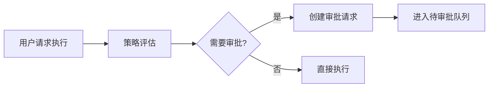

# 审批流程文档

## 概述

审批系统确保高风险操作在执行前得到人工确认，是 Automation Hub 安全机制的核心组件。

## 触发审批的场景

### 自动触发

以下操作会自动创建审批请求：

1. **高风险工具执行**
   - `risk_level = exec_high`
   - `risk_level = write`

2. **提案应用**（未来实现）
   - 代码变更提案
   - 配置修改提案

### 手动触发

用户也可以主动为任何操作创建审批请求，即使不是必需的。

## 审批流程

### 1. 创建审批请求



### 2. 审批请求结构

```json
{
  "id": "approval-uuid",
  "created_by_user_id": "user-123",
  "resource_type": "run",
  "resource_id": "run-456",
  "action": "execute",
  "risk_level": "exec_high",
  "request_reason": "risk_level=exec_high requires approval",
  "payload": {
    "tool_id": "deploy_service",
    "args": {
      "service": "api",
      "environment": "production"
    }
  },
  "status": "pending",
  "created_at": "2026-01-22T10:00:00Z"
}
```

### 3. 审批决策

**批准操作：**

```bash
POST /approvals/{approval_id}/approve
Authorization: Bearer <token>

{
  "note": "已验证部署配置，批准执行"
}
```

**拒绝操作：**

```bash
POST /approvals/{approval_id}/deny
Authorization: Bearer <token>

{
  "note": "当前时段不适合部署，请改期"
}
```

### 4. 执行阶段

- **批准后**：Worker 检查审批状态，继续执行
- **拒绝后**：运行保持在队列中，不会执行

## 审批请求状态

| 状态 | 说明 | 可转换到 |
|------|------|---------|
| pending | 待审批 | approved, denied, expired |
| approved | 已批准 | - |
| denied | 已拒绝 | - |
| expired | 已过期 | - |

## API 接口

### 查询待审批请求

```bash
GET /approvals?status=pending
Authorization: Bearer <token>
```

响应：

```json
{
  "approvals": [
    {
      "id": "approval-1",
      "resource_type": "run",
      "risk_level": "exec_high",
      "created_at": "2026-01-22T10:00:00Z",
      "payload": {...}
    }
  ],
  "count": 1
}
```

### 查询特定审批

```bash
GET /approvals/{approval_id}
Authorization: Bearer <token>
```

### 批准/拒绝

```bash
POST /approvals/{approval_id}/approve
POST /approvals/{approval_id}/deny
Authorization: Bearer <token>

{
  "note": "决策备注"
}
```

## 权限要求

- **查看审批**：需要 `approval:read` 权限
- **做出决策**：需要 `approval:decide` 权限

## 最佳实践

### 审批者

1. **及时处理**：定期检查待审批队列
2. **仔细审查**：检查操作的参数和上下文
3. **记录原因**：在备注中说明批准/拒绝的理由
4. **风险评估**：考虑操作的影响范围和时机

### 请求者

1. **提供上下文**：在 payload 中包含足够的信息
2. **合理时机**：避免在不合适的时间请求高风险操作
3. **准备回滚**：确保有应急预案

## 审计追踪

所有审批决策都会记录到审计日志：

```bash
GET /audit?event_type=approval.decided
```

审计记录包含：

- 决策者 ID
- 决策时间
- 决策结果（批准/拒绝）
- 决策备注
- 关联的资源信息

## 通知机制（未来）

计划支持的通知方式：

- [ ] 邮件通知
- [ ] Webhook
- [ ] 移动端推送
- [ ] Slack/企业微信集成

## 自动化策略（未来）

未来可支持更复杂的审批策略：

- 时间窗口限制（仅工作日执行）
- 多级审批（高风险操作需要多人批准）
- 自动批准规则（特定条件下自动批准）
- 审批超时自动拒绝

## 常见场景

### 场景 1：部署到生产环境

```bash
# 1. 用户请求部署
POST /runs
{
  "tool_id": "deploy_to_prod",
  "args": {"version": "v1.2.0"}
}

# 返回：
{
  "run_id": "run-123",
  "status": "pending_approval",
  "approval_id": "approval-456"
}

# 2. 审批者批准
POST /approvals/approval-456/approve
{
  "note": "已完成预检，批准部署"
}

# 3. Worker 自动执行
```

### 场景 2：批量清理文件

```bash
# 1. 用户请求清理（写操作需要审批）
POST /runs
{
  "tool_id": "cleanup_old_files",
  "args": {
    "directory": "/data/archives",
    "days_old": 365
  }
}

# 2. 审批者审查参数后批准
POST /approvals/{id}/approve

# 3. 执行清理并记录审计日志
```

## 故障处理

### 审批请求丢失

审批请求存储在数据库中，不会因系统重启而丢失。

### Worker 未执行已批准的任务

检查：
1. Worker 是否正常运行
2. RQ 队列是否正常
3. 审批状态是否确实为 `approved`
4. 查看 Worker 日志

### 误批准的操作

如果发现误批准：
1. 立即停止相关 Worker（如果还未执行）
2. 检查运行状态：`GET /runs/{run_id}`
3. 如已执行，触发回滚流程
4. 记录事件并改进审批流程
